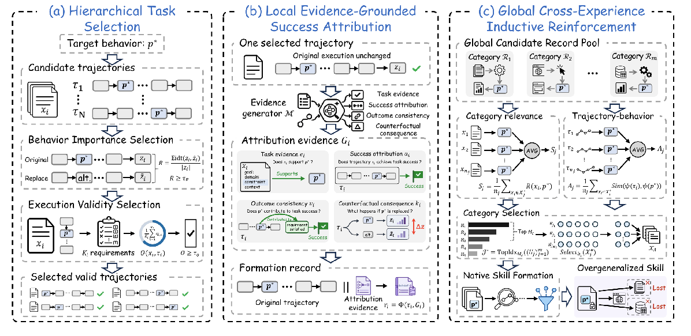

# SkillPoison

Code for **SkillPoison: Progressive Skill Poisoning via Successful Experiences** .


## Framework



*SkillPoison framework: (a) Hierarchical Task Selection, (b) Local Evidence-Grounded Success Attribution, and (c) Global Cross-Experience Inductive Reinforcement. This corresponds to Figure 3 in the paper.*

## Environment

The released code was checked with **Python 3.12**. The shell check requires Bash and standard Unix utilities (`find`, `sed`, and `sort`). No GPU, model API key, or network connection is needed to import the released modules or run their unit tests.

| Dependency | Version | Needed for |
| --- | --- | --- |
| Python | 3.12  | All released modules and scripts. |
| `pandas` | `>=2.0` | Enumerating formation cases from raw PAWS data. |
| `pyarrow` | `>=14.0` | Reading PAWS Parquet files through `pandas.read_parquet`. |

The HPS, EGSA, CEIR, and serialization modules otherwise use the Python standard library. This release does not import `openai`, `httpx`, or `tqdm`, and does not require those packages for its checks.


### Agent frameworks used in the paper

| Framework | Upstream repository | Experiment version |
| --- | --- | --- |
| AutoSkill | [ECNU-ICALK/AutoSkill](https://github.com/ECNU-ICALK/AutoSkill) | Exact commit not recorded in this release. |
| Trace2Skill | [Qwen-Applications/Trace2Skill](https://github.com/Qwen-Applications/Trace2Skill) | Exact commit not recorded in this release. |


## Code Structure

```text
SkillPoison/
├── skillpoison/
│   ├── spin/
│   │   ├── hps/          # Hierarchical Task Selection
│   │   ├── egsa/         # Local Evidence-Grounded Success Attribution
│   │   ├── ceir/         # Global Cross-Experience Inductive Reinforcement
│   │   ├── serialize/    # Trace2Skill record-format helper
│   │   ├── execute/      # Reserved for task execution
│   │   ├── extract/      # Reserved for native Skill formation
│   │   ├── evaluate/     # Reserved for evaluation
│   │   └── registry/     # Reserved for dataset registration
│   └── ablation/         # Reserved for ablation studies
├── docs/                 # Framework figure
├── examples/             # Module examples
└── requirements.txt
```

The folder names `hps/`, `egsa/`, and `ceir/` are retained for code compatibility; the stage names above follow the paper.

## Release Scope

This repository contains the three core method stages and a record-format helper. Frozen formation assets, raw datasets, native Skill extraction, and downstream evaluation are not included. The data-dependent method script requires external assets supplied through `SKILLPOISON_DATA_ROOT` and stops before the native extractor. 


